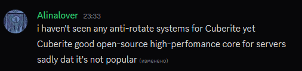

# AntiMell - AntiRotate system based on Lua and created for Cuberite

# Reason for creation

  

| Parameter | Description | Default |
|----------|----------|--------------|
| `MaxYawPerTick` | Max yaw change per tick (degrees) | 90 |
| `MaxPitchPerTick` | Max pitch change per tick (degrees) | 90 |
| `MaxYawPerSecond` | Max yaw change per second (degrees) | 360 |
| `MaxPitchPerSecond` | Max pitch change per second (degrees) | 360 |
| `MinRotationDelta` | Minimum rotation change to check (degrees) | 0.01 |
| `MinTimeBetweenRotates` | Minimum time between rotations (seconds) | 0.05 |
| `Allow180QuickTurn` | Allow quick 180° turn | true |
| `IgnoreCreative` | Ignore players in creative mode | false |
| `IgnoreOps` | Ignore server operators | false |
| `EnableYawCheck` | Enable yaw checking | true |
| `EnablePitchCheck` | Enable pitch checking | true |
| `Debug` | Debug mode | false |

Tell me bout' the bugs - ds: lublu.alinu

